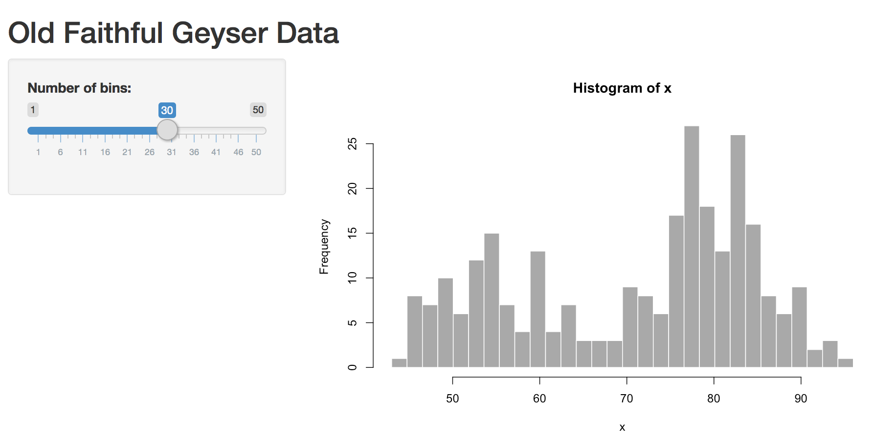

```{r setup, include=FALSE}
knitr::opts_chunk$set(echo = TRUE)
```
## Overview of R Shiny 

R Shiny provides a way to create interactive visualizations and web applets

There are two key components of an R Shiny Script:

1. The ui (user interface) provides a way for the user to interactive with the visualization and for the program to capture input values.
2. The server piece takes those outputs and applies them to R code.

# Server Code

## Under the hood: Server Code
```{r, eval=F,mysize=TRUE,size = '\\footnotesize'}
# Define server logic required to draw a histogram
server <- function(input, output) {
  
  output$distPlot <- renderPlot({
    # generate bins based on input$bins from ui.R
    x    <- faithful[, 2] 
    bins <- seq(min(x), max(x), length.out = input$bins + 1)
    
    # draw the histogram with the specified number of bins
    hist(x, breaks = bins, col = 'darkgray', border = 'white')
  })
}
```


## Under the hood: Server Code - This is just R Code
```{r,eval=F,mysize=TRUE,size = '\\footnotesize'}
    input.bins <- 30 # number of bins
    x   <- faithful[, 2] 
    bins <- seq(min(x), max(x), length.out = input.bins + 1)
      # draw the histogram with the specified number of bins
    hist(x, breaks = bins, col = 'darkgray', border = 'white')
```


## Under the hood: Server Code
```{r, mysize=TRUE, eval=T, size='\\tiny',fig.align='center', echo = F}
    input.bins <- 30 # number of bins
    x   <- faithful[, 2] 
    bins <- seq(min(x), max(x), length.out = input.bins + 1)
      # draw the histogram with the specified number of bins
    hist(x, breaks = bins, col = 'darkgray', border = 'white')
```


## Under the hood: Server Code -  Change # of Bins
```{r, mysize=TRUE, eval=T, size='\\tiny',fig.align='center', echo = F}
    input.bins <- 15 # number of bins
    x   <- faithful[, 2] 
    bins <- seq(min(x), max(x), length.out = input.bins + 1)
      # draw the histogram with the specified number of bins
    hist(x, breaks = bins, col = 'darkgray', border = 'white')
```

# UI Code

## Under the Hood: UI Code
```{r,eval=F, mysize=TRUE, eval=F, size='\\footnotesize'}
# Define UI for application that draws a histogram
ui <- fluidPage(
   # Application title
   titlePanel("Old Faithful Geyser Data"),
   # Sidebar with a slider input for number of bins 
   sidebarLayout(
      sidebarPanel(
         sliderInput("bins", 
                     "Number of bins:",
                     min = 1,
                     max = 50,
                     value = 30)
      ),
      # Show a plot of the generated distribution
      mainPanel(
         plotOutput("distPlot")
      )
   )
)
```

## Shiny Code: Running the Application
```{r,eval=F, mysize=TRUE, eval=F, size='\\footnotesize'}
# Define server logic required to draw a histogram
server <- function(input, output) {
   
   output$distPlot <- renderPlot({
      # generate bins based on input$bins from ui.R
      x    <- faithful[, 2] 
      bins <- seq(min(x), max(x), length.out = input$bins + 1)
      
      # draw the histogram with the specified number of bins
      hist(x, breaks = bins, col = 'darkgray', border = 'white')
   })
}

# Run the application 
shinyApp(ui = ui, server = server)
```

## Shiny Output


## Shiny Web Applet

- see demo in video

## Shiny in RMarkdown HTML file

- see demo in video